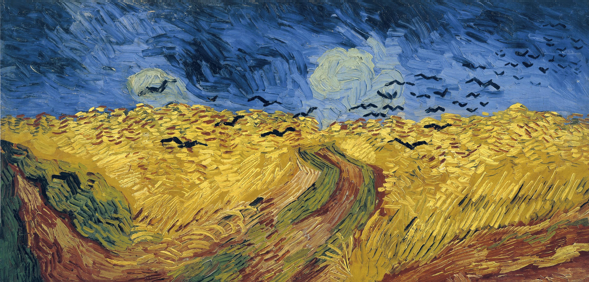

#


#
RRFVCM

###
[中文文档](./README-ch.md)

## Preface
RWKV RNN LLM speech motion and action generater
### Original Intention
A speech motion and action generation AI based on the RWKV model architecture
### Convention
- Unless otherwise specified, the instructions in the document are executed in the project root directory.
- ```python``` = ```python3```  if not process```sudo apt install python-is-python3```
## Preparation

### Preparation Environment
- Install [Python](https://python.org)
- Install CUDA/ROCm with the latest PyTorch version
- install pip lib ```pip install -r requirements.txt```

### Download pre-trained weights
Put pre-trained weights in ```weigths/pretrained/```
- RWKV-LM [RWKV-x060-World-1B6-v2-20240208-ctx4096.pth](https://huggingface.co/BlinkDL/rwkv-6-world/resolve/main/RWKV-x060-World-1B6-v2-20240208-ctx4096.pth)
- Bert [s1bert.ckpt](https://huggingface.co/lj1995/GPT-SoVITS/resolve/main/s1bert25hz-2kh-longer-epoch%3D68e-step%3D50232.ckpt)
- HuBert [hubert_base.pt](https://huggingface.co/lj1995/VoiceConversionWebUI/resolve/main/hubert_base.pt)
- RMVPE [rmvpe.pt](https://huggingface.co/lj1995/VoiceConversionWebUI/resolve/main/rmvpe.pt)

### Inspect
- process ```python  models/language_test.py```    (If the interaction is normal, it means the preparation is correct.)

## Qiuvk Start
- Install the model [None](https://nothing)
- Install  the VC model [None](https://nothing)
- Launching！ ```python webui.py```

## Project Structure

## Trianing
- In the trianing processing [OpenSeeFace](https://github.com/emilianavt/OpenSeeFace/releases) Extract facial features，configure the path in ```config/openseeface.json``` 
- Automatic speech annotation may be required for some datasets [DeepSpeech]](https://github.com/mozilla/DeepSpeech)

### Prepare Dataset 
You can prepare the data yourself or refer to the following datasets:
- voice、text [Mozilla Common Voice](https://commonvoice.mozilla.org/zh-CN)
- voice、face [CelebV-Text](https://github.com/celebv-text/CelebV-Text)

### Dataset preprocessing
- Video or audio fragments（25FPS * 40s a piece，Corresponding to non-language model 25FPS * 1024CTX） ```python ```
- Estract hubert and f0 ```python ```
- Extract facial features from video征 ```python ```

### Trianing T2F0

### Trianing TF02M

### Expand

## Have some problems?
- parselmouth instal faild: Downgrade ```setuptools```  to 58.0 temporarly

## The other things

### Future Directions

### Acknowledgements
- [RWKV-LM](https://github.com/BlinkDL/RWKV-LM)
- [SoftVC VITS Singing Conversion](https://github.com/justinjohn0306/so-vits-svc-4.0/tree/4.0-v2)
- [GPT-SoVITS-WebUI](https://github.com/RVC-Boss/GPT-SoVITS)
- [RMVPE](https://github.com/Dream-High/RMVPE)
- [Retrieval-based-Voice-Conversion-WebUI](https://github.com/RVC-Project/Retrieval-based-Voice-Conversion-WebUI)
- [OpenSeeFace](https://github.com/emilianavt/OpenSeeFace)
- [DeepSpeech](https://github.com/mozilla/DeepSpeech)
- [Mozilla Common Voice](https://commonvoice.mozilla.org/zh-CN)
- [CelebV-Text](https://github.com/celebv-text/CelebV-Text)
- Radeon Pro w7900 provided by [AMD](https://amd.com) 
